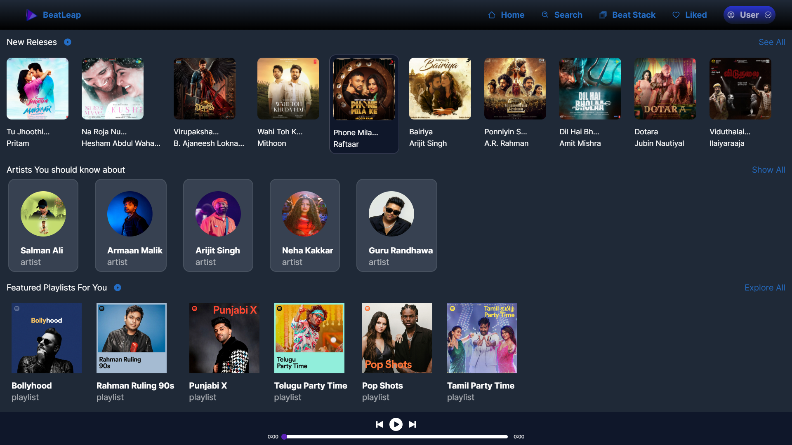
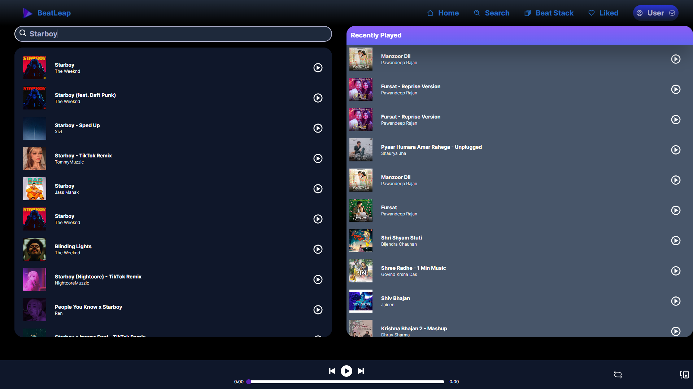
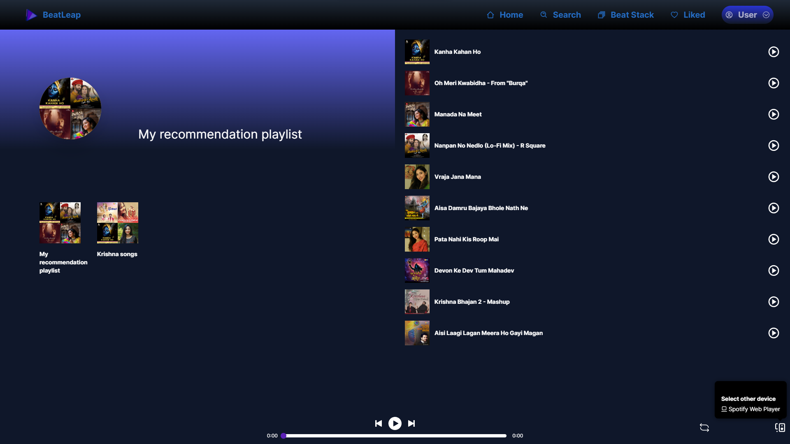
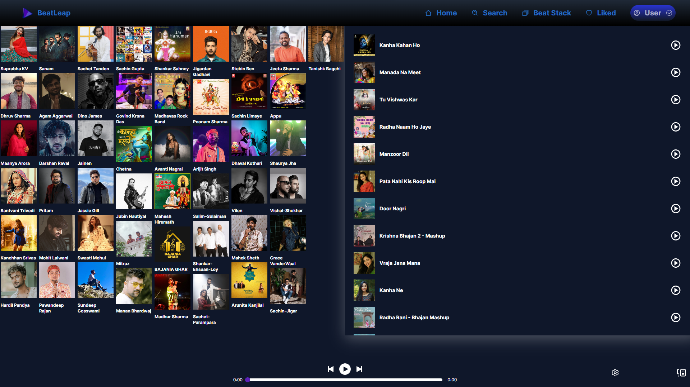
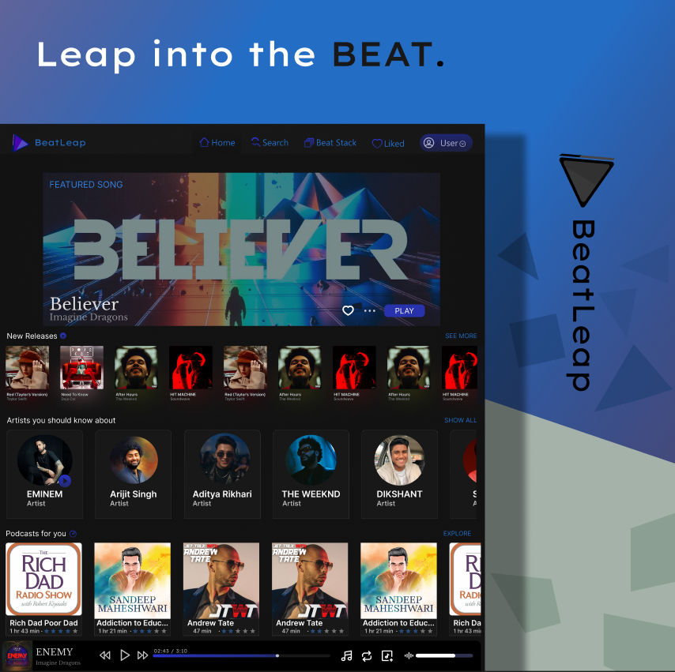

# BeatLeap

BeatLeap is a a Music WebApp which uses the API of Spotify.
You can access a vast collection of high quality royalty free music across various genres and moods.

## Preview

## Features

- Interactive Home Page
- Live previews
- Fullscreen mode
- Cross platform
- Beat-Stack (Playlist)
- Song Suggestions

## Stack Used

- Tailwind CSS
- Next JS
- Spotify Web API

## Creators

- UI Designed by - [Vishwas Bhambhani](https://www.github.com/Vishwas904)
- Web Developed by - [Yash Soni](https://github.com/yashsoni23)

## Page 1 - Home Page

Welcome to our platform, your one-stop destination for all things music! We've got you covered with a wide range of exciting features, including newly released songs, handpicked playlists, popular categories, and talented artists. Dive into the latest hits, groove to curated playlists, explore different genres, and find your favorite tunes effortlessly. Join us on this musical adventure and let the rhythm guide you to your perfect soundtrack.

## Page 2 - Search & Recommendation Section

This Page is devided into two sections. the first section suggests you Songs and Artists. The other Section shows your recent plays. The upper section of the suggestions is a search bar where you can search whichever song you want to listen.

## Page 3 - Beat Stack (Playlist)

This section is based on Playslists only. On the left side, you can see Playlists created by you and on the other side you can see suggestions of multiple playlist in different genres.

## Page 4 - Liked Section

This section has all the records of your liked Songs, Artists, Playlist and Movie Playlist that you've liked by clicking on the like button.

## Note

You can click on the BeatLeap logo to log out from the Web App.

## Logo

# UI Design Preview & link

## Preview

- [BeatLeap](https://www.figma.com/file/mhxsRJC8smaikxftgjlnmH/BeatLeap?type=design&t=PQmQVZj5YPPplTYd-6)

## Feedback

If you have any feedback, please reach out to us at yashsoni48678@gmail.com
